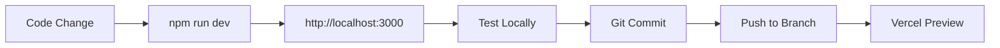
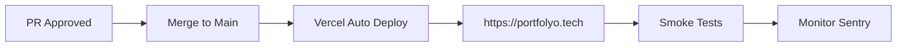

# 🔐 Ortam Karşılaştırması

## Development vs Production

| Özellik               | Development             | Production               |
| --------------------- | ----------------------- | ------------------------ |
| **Domain**            | `http://localhost:3000` | `https://portfolyo.tech` |
| **NODE_ENV**          | `development`           | `production`             |
| **Env Dosyası**       | `.env.local`            | Vercel Env Vars          |
| **Git'e Eklenir mi?** | ❌ ASLA                 | ❌ ASLA                  |

## Servis Ayrımı

### Supabase Database

| Özellik          | Development                     | Production                                 |
| ---------------- | ------------------------------- | ------------------------------------------ |
| **Proje Adı**    | `portfolyo-dev`                 | `portfolyo-prod` (mevcut)                  |
| **URL**          | `https://[dev-ref].supabase.co` | `https://srgvpcwbcjsuostcexmn.supabase.co` |
| **Anon Key**     | Ayrı key                        | Ayrı key                                   |
| **Service Role** | Ayrı key                        | Ayrı key                                   |
| **Data**         | Test/fake data                  | Real user data                             |
| **RLS**          | Aktif                           | Aktif                                      |

### GitHub OAuth

| Özellik           | Development                                      | Production                                        |
| ----------------- | ------------------------------------------------ | ------------------------------------------------- |
| **App Name**      | PortfolYO Dev                                    | PortfolYO                                         |
| **Homepage**      | `http://localhost:3000`                          | `https://portfolyo.tech`                          |
| **Callback**      | `http://localhost:3000/api/auth/callback/github` | `https://portfolyo.tech/api/auth/callback/github` |
| **Client ID**     | `Ov23li...` (ayrı)                               | `Ov23li...` (ayrı)                                |
| **Client Secret** | Ayrı secret                                      | Ayrı secret                                       |

### Stripe Payment

| Özellik             | Development                                | Production                                  |
| ------------------- | ------------------------------------------ | ------------------------------------------- |
| **Mode**            | Test Mode                                  | Live Mode                                   |
| **Publishable Key** | `pk_test_*`                                | `pk_live_*`                                 |
| **Secret Key**      | `sk_test_*`                                | `sk_live_*`                                 |
| **Webhook Secret**  | Test webhook                               | Live webhook                                |
| **Webhook URL**     | `http://localhost:3000/api/stripe/webhook` | `https://portfolyo.tech/api/stripe/webhook` |
| **Test Cards**      | ✅ Kullan                                  | ❌ Asla                                     |

### Upstash Redis

| Özellik           | Development                | Production                              |
| ----------------- | -------------------------- | --------------------------------------- |
| **Database Name** | `portfolyo-dev`            | `portfolyo-prod`                        |
| **URL**           | `https://dev-*.upstash.io` | `https://devoted-joey-37674.upstash.io` |
| **Token**         | Ayrı token                 | Ayrı token                              |
| **Region**        | Herhangi                   | Same as app                             |

### Sentry Error Tracking

| Özellik         | Development                 | Production       |
| --------------- | --------------------------- | ---------------- |
| **Project**     | `portfolyo-dev` (opsiyonel) | `portfolyo-prod` |
| **DSN**         | Test DSN                    | Production DSN   |
| **Environment** | `development`               | `production`     |
| **Release**     | Dev builds                  | Tagged releases  |

## Environment Variables

### Development (.env.local)

```bash
NODE_ENV=development
NEXT_PUBLIC_APP_URL=http://localhost:3000
NEXTAUTH_URL=http://localhost:3000
NEXTAUTH_DEBUG=true
NEXT_PUBLIC_DEMO_MODE=true  # Opsiyonel

# Development servisleri (AYRI credentials)
GITHUB_CLIENT_ID=<dev-oauth-app>
GITHUB_CLIENT_SECRET=<dev-secret>
NEXT_PUBLIC_SUPABASE_URL=<dev-project-url>
SUPABASE_SERVICE_ROLE_KEY=<dev-service-role>
STRIPE_SECRET_KEY=sk_test_<test-key>
UPSTASH_REDIS_REST_TOKEN=<dev-token>
```

### Production (Vercel Environment Variables)

```bash
NODE_ENV=production
NEXT_PUBLIC_APP_URL=https://portfolyo.tech
NEXTAUTH_URL=https://portfolyo.tech
NEXTAUTH_DEBUG=false
NEXT_PUBLIC_DEMO_MODE=false

# Production servisleri (AYRI credentials)
GITHUB_CLIENT_ID=<prod-oauth-app>
GITHUB_CLIENT_SECRET=<prod-secret>
NEXT_PUBLIC_SUPABASE_URL=<prod-project-url>
SUPABASE_SERVICE_ROLE_KEY=<prod-service-role>
STRIPE_SECRET_KEY=sk_live_<live-key>
UPSTASH_REDIS_REST_TOKEN=<prod-token>
```

## Workflow Karşılaştırması

### Development Workflow



### Production Workflow



## Secret Güvenlik Matrisi

| Secret Type                   | Development   | Production     | Git'e Ekle? |
| ----------------------------- | ------------- | -------------- | ----------- |
| **NEXTAUTH_SECRET**           | Random string | Strong random  | ❌ ASLA     |
| **GITHUB_CLIENT_SECRET**      | Dev OAuth     | Prod OAuth     | ❌ ASLA     |
| **SUPABASE_SERVICE_ROLE_KEY** | Dev project   | Prod project   | ❌ ASLA     |
| **STRIPE_SECRET_KEY**         | `sk_test_*`   | `sk_live_*`    | ❌ ASLA     |
| **UPSTASH_REDIS_REST_TOKEN**  | Dev DB        | Prod DB        | ❌ ASLA     |
| **NEXT_PUBLIC_SUPABASE_URL**  | Dev URL       | Prod URL       | ✅ Public   |
| **NEXT_PUBLIC_APP_URL**       | localhost     | Production URL | ✅ Public   |

## Deployment Karşılaştırması

| Özellik            | Development    | Production        |
| ------------------ | -------------- | ----------------- |
| **Deploy Trigger** | Manual / PR    | Push to `main`    |
| **Deploy Time**    | ~1 min         | ~2 min            |
| **Preview URL**    | `*.vercel.app` | `portfolyo.tech`  |
| **Rollback**       | Delete preview | `vercel rollback` |
| **Testing**        | Optional       | Required          |
| **Approval**       | None           | Team approval     |

## Test Data Stratejisi

### Development

- ✅ Fake GitHub repos
- ✅ Test credit cards (Stripe)
- ✅ Mock user accounts
- ✅ Synthetic analytics data
- ✅ Debug logs enabled

### Production

- ✅ Real GitHub repos
- ✅ Real credit cards
- ✅ Real user accounts
- ✅ Real analytics data
- ⚠️ Debug logs disabled

## Maliyet Karşılaştırması

### Development (Ücretsiz/Düşük)

- Supabase: Free tier
- Vercel: Free previews
- Stripe: Test mode (ücretsiz)
- Upstash: Free tier
- Sentry: Developer tier

### Production (Ücretli)

- Supabase: Pro ($25/mo)
- Vercel: Pro ($20/mo)
- Stripe: Transaction fees (2.9% + $0.30)
- Upstash: Pay-as-you-go
- Sentry: Team ($26/mo)

**Toplam Tahmini Maliyet:** ~$100-150/mo (kullanıma göre)

## Monitoring & Alerts

| Metric                | Development      | Production             |
| --------------------- | ---------------- | ---------------------- |
| **Uptime Monitoring** | ❌ Gerekli değil | ✅ UptimeRobot/Pingdom |
| **Error Tracking**    | ✅ Sentry (dev)  | ✅ Sentry (prod)       |
| **Performance**       | ✅ Local tools   | ✅ Vercel Analytics    |
| **Logs**              | ✅ Console       | ✅ Vercel Logs         |
| **Alerts**            | ❌ Yok           | ✅ Email/Slack         |

---

**Last Updated:** 2025-10-03
